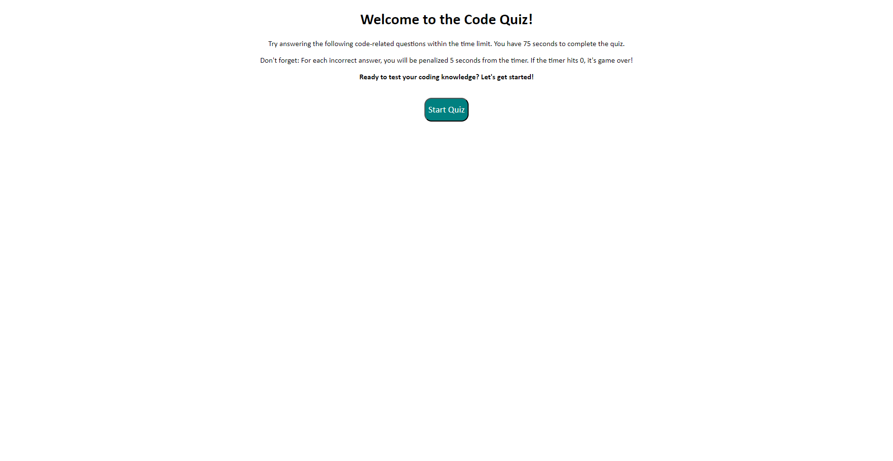

# Quiz-Project

This assignment involved creating a coding quiz in the browser through the use of css html and javascript. This project can be used to quickly quiz yourself on api topics and has a working timer and scoreboard function. 

## Installation
To install this project simply clone the repository and then open code with the use of a code editor such as visual studio. You can also visit the deployed page from my github page or from the link here 

https://t0ny-macaroni.github.io/Quiz-Project/

## Usage

Opening this page in a browser will allow you to quickly quiz yourself on api topics, you will be able to see your score at the end and also a scoreboard of your previous scores.

